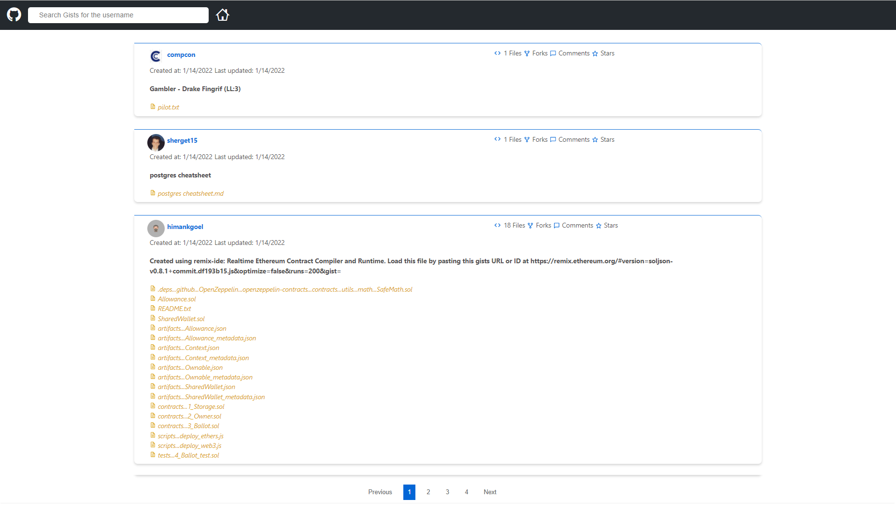

<p align="center">
  <h3 align="center">Gist User Search</h3>
  <p align="center">
    This project is using GitHub's public<a href="https://docs.github.com/en/rest/reference/gists"> Gists API </a> to perform the gist search and to read public gists anonymously along with Github's <a href="https://octokit.github.io/rest.js/v18/"> Octokit REST API </a>.
    <br />
    <br />
    <br />
    <a href="https://user-gists-search.netlify.app">View Demo</a>
    ·
    <a href="https://github.com/iamvips/gist-user-search/issues">Report Bug</a>
  </p>
</p>

<!-- TABLE OF CONTENTS -->

## Table of Contents

- [About the Project](#about-the-project)
  - [Built With](#built-with)
- [Getting Started](#getting-started)
  - [Installation](#installation)
- [Roadmap](#roadmap)
- [Contact](#contact)

<!-- ABOUT THE PROJECT -->

## About The Project

<kbd>

</kbd>

<br />
<br />
<br />
<br>
There is one search field for the user to type the username that they want to search.

### Built With

This is a [React](https://reactjs.org/docs/create-a-new-react-app.html) project bootstrapped with [`create-react-app`](https://reactjs.org/docs/create-a-new-react-app.html#create-react-app).

- [React](https://reactjs.org/)
- [JavaScript](https://developer.mozilla.org/en-US/docs/Web/JavaScript)
- [Redux](https://redux.js.org/)
- [Redux-persist](https://github.com/rt2zz/redux-persist)
- [Hooks](https://reactjs.org/docs/hooks-intro.html)
- [React Testing Library](https://testing-library.com/docs/react-testing-library/intro/)
- [Jest](https://jestjs.io/)
- [Cypress](https://docs.cypress.io/guides/overview/why-cypress#In-a-nutshell)

<!-- GETTING STARTED -->

## Getting Started

To get a local copy up and running follow these simple steps.

### Installation

1. Clone the repo

```sh
git clone https://github.com/iamvips/gist-user-search.git
```

2. Install NPM packages

```sh
npm install
```

3. Run the development server:

```bash
npm start
```

4. Run the tests:

```bash
npm run test
```

5. Run the end to end tests using Cypress in headless mode:

```bash
npm run cypress
```

6. Run the end to end tests using Cypress in browser:

```bash
npm run cypress:open
```

<!-- ROADMAP -->

## Roadmap

See the [open issues](https://github.com/iamvips/gist-user-search/issues) for a list of proposed features (and known issues).

<!-- CONTACT -->

## Contact

Vipul Chawda - [@iamvips_ch](https://twitter.com/iamvips_ch) - vipul.chawda@outlook.com
